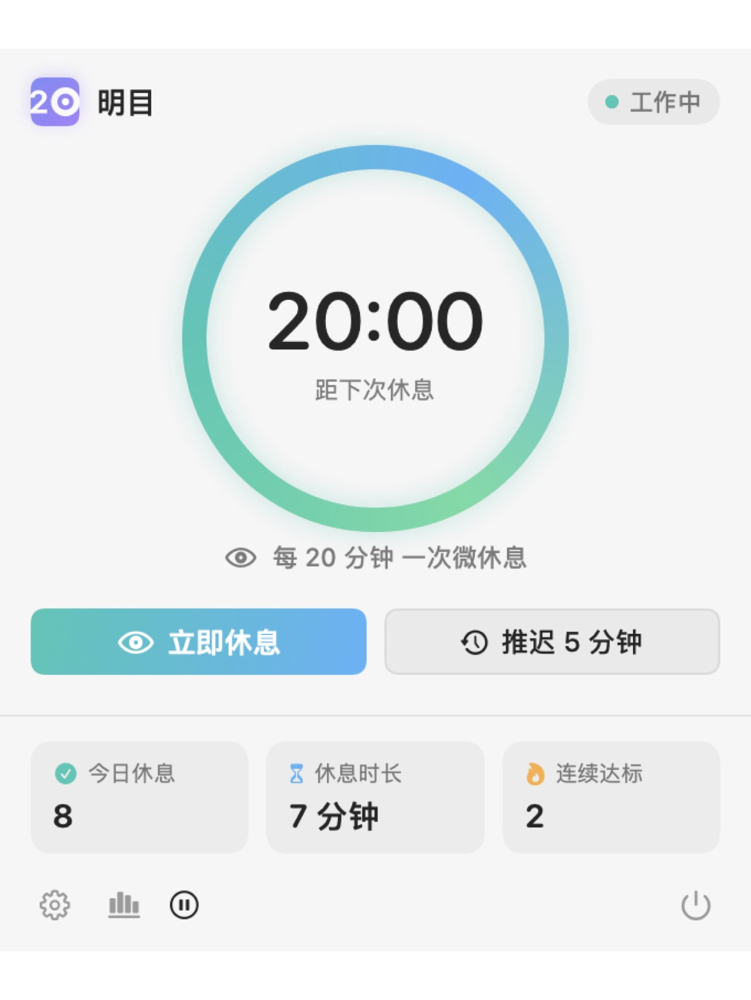
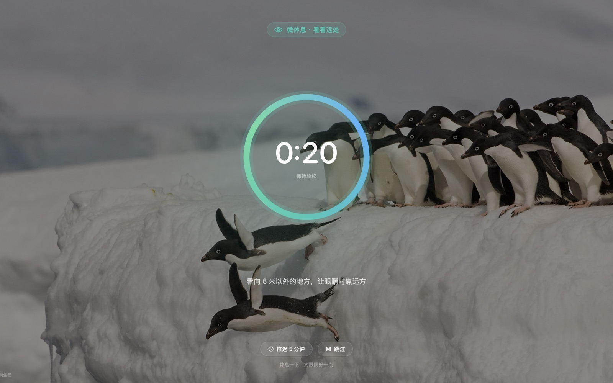
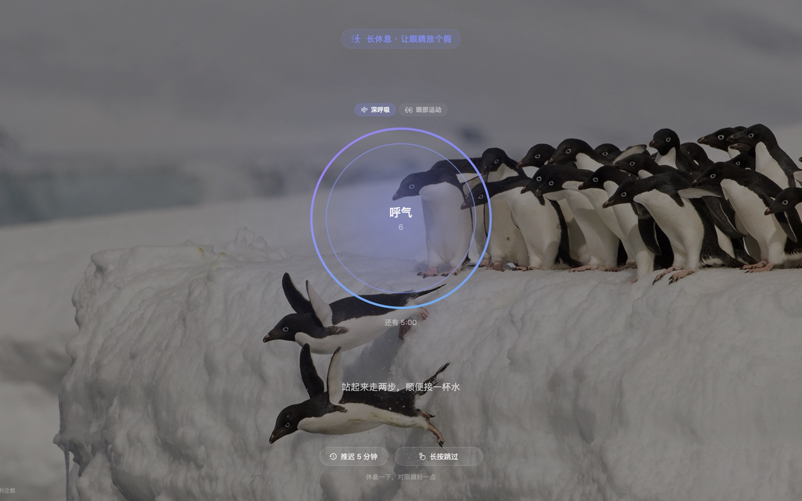
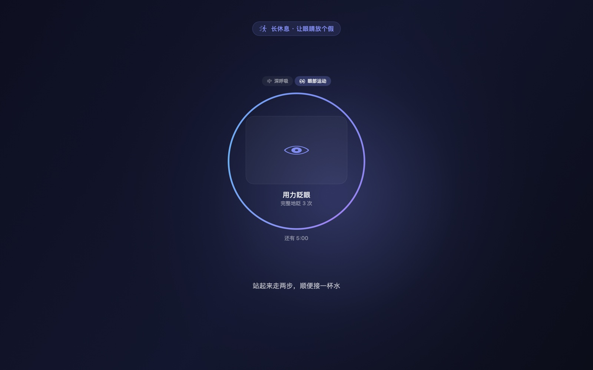
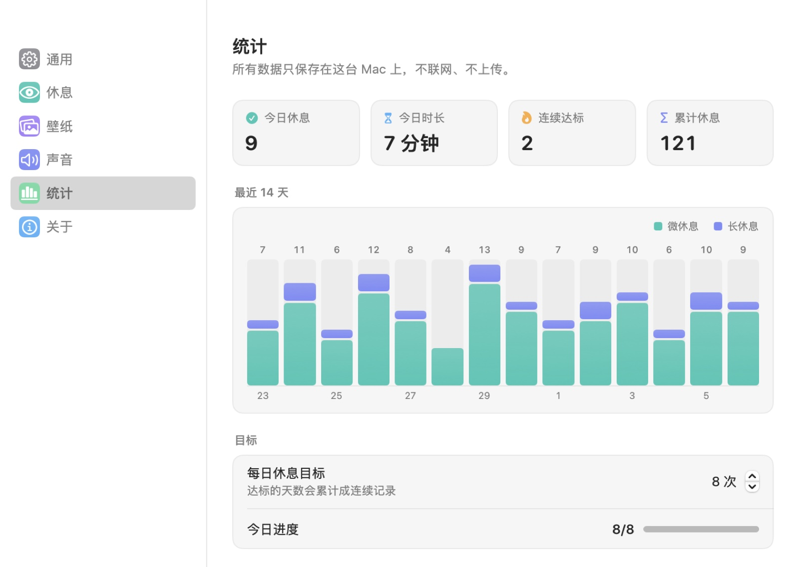
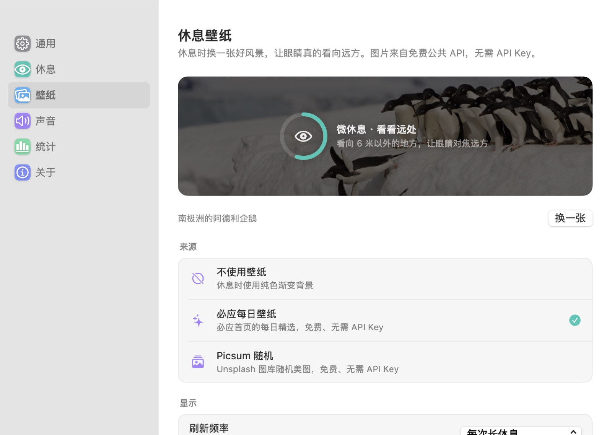
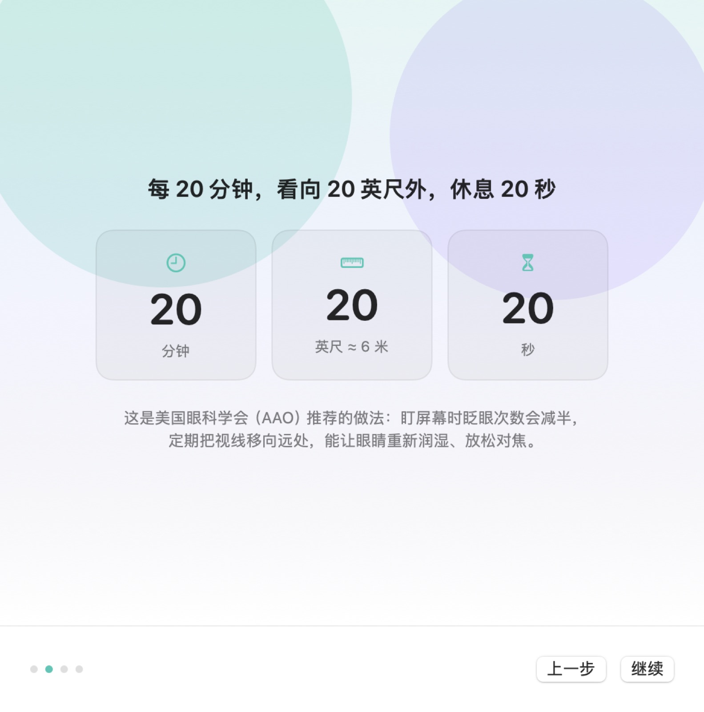

# Mingmu (明目) · Iris

[简体中文](README.md) · **English**

> Give your eyes a moment.

A native macOS break reminder, written by hand in SwiftUI + AppKit. No third-party dependencies, no network calls except for the optional wallpapers.

```
Every 20 minutes of screen time, look at something 20 feet away for at least 20 seconds.
                                                    — the 20-20-20 rule, recommended by the AAO
```

---

## Screenshots

| Menu bar popover | Break overlay |
| --- | --- |
|  |  |

| Long break · breathing | Long break · eye exercises |
| --- | --- |
|  |  |

| Statistics | Wallpaper | Welcome tour |
| --- | --- | --- |
|  |  |  |

All screenshots are rendered offscreen by `swift run IrisSnapshot`, so they show exactly what the app draws.

---

## Features

### Two kinds of breaks

- **Micro breaks** — every 20 minutes by default, 20 seconds each. This is the classic 20-20-20 rhythm.
- **Long breaks** — every 60 minutes by default, 5 minutes each, meant for actually getting up.
- Three presets (Classic / Relaxed / Strict) plus full manual control. A micro break that falls within 90 seconds of a long break is merged into it.

### It tries not to get in the way

- **Away means rested.** If you leave the keyboard for more than 2 minutes, that counts as a break. When you come back you start a fresh cycle — the app never "catches up" on missed reminders.
- **Fullscreen deferral.** Watching a movie or playing a game fullscreen defers the reminder until you're done. It only counts as "media" when audio is actually playing, so fullscreen coding or reading still gets reminders — otherwise developers would never see one.
- **Gentle mode by default.** The overlay never takes keyboard focus, so you can keep typing. A "focus mode" option takes over the keyboard instead.
- **Heads-up first.** 10 seconds before a micro break (30 for a long one), a small capsule appears at the top of the screen with a countdown and a "start now" button.

### The break itself

- A fullscreen overlay on every display, drawn above fullscreen apps and the menu bar.
- Micro breaks: a large countdown ring and one line of advice, rotating every 8 seconds.
- Long breaks: pick between a guided **4s-in / 6s-out breathing exercise** and **six eye exercises** (follow the dot), switchable mid-break.
- `Esc` postpones for 5 minutes (safer than skipping). In strict mode, skipping requires a 3-second press-and-hold. Postponing is limited to twice in a row.
- Optional chime at the start and end, with preview and volume.

### Break wallpapers

- Sources: **Bing's daily wallpaper** and **Lorem Picsum** — both free, neither needs an API key.
- Refreshes on a schedule you choose (every break / every long break / daily), keeps the last 8 images locally so breaks work offline, and credits the photographer automatically.

### Menu bar and shortcuts

- Lives in the menu bar. The icon reflects the state (working / on a break / paused) and can show a countdown.
- Left click opens the popover; right click opens a quick menu.
- Global shortcuts: `⌃⌥⌘B` to take a break now, `⌃⌥⌘P` to pause or resume.

### Statistics

- Breaks today, total rest time, current streak, and an all-time count, plus a stacked bar chart of the last 14 days.
- Everything is stored locally and can be cleared from the settings.

### Privacy

- **No system permissions required.** No camera, no keyboard monitoring (the global hotkeys use Carbon, which doesn't need Accessibility), no screen recording.
- **No network access** unless you enable wallpapers. Nothing is uploaded, there is no telemetry and no account.

---

## Installation

### Download (recommended)

👉 **[Latest release](https://github.com/vex67-cyber/iris-macos/releases/latest)** — `Mingmu-1.0.0.dmg`, 3.4 MB, macOS 12+, Apple Silicon

1. Open the DMG and drag **明目** into your Applications folder.
2. The first time you open it, **right-click the icon and choose Open** — the app isn't notarized by Apple, so a plain double-click is blocked by Gatekeeper. After that, double-clicking works normally.
3. If macOS still refuses to launch it, run this once:

   ```
   xattr -dr com.apple.quarantine /Applications/明目.app
   ```

On an Intel Mac, build from source instead — the repository ships with build and packaging scripts.

### Build from source

Requires macOS 12+ and the Xcode Command Line Tools.

```bash
git clone https://github.com/vex67-cyber/iris-macos.git
cd iris-macos

./scripts/build-app.sh          # compile, generate the icon, assemble and sign the .app
./scripts/install.sh --open     # copy it into /Applications and launch
./scripts/make-dmg.sh           # optional: package a distributable DMG
```

### First launch

1. A four-step welcome tour explains 20-20-20, lets you pick a rhythm, and offers to launch at login.
2. After that the app lives in your menu bar — the eye icon.
3. Click it to see the countdown, take a break, or postpone.

---

## Usage

### Shortcuts

| Shortcut | Action |
| --- | --- |
| `⌃⌥⌘B` | Take a break now |
| `⌃⌥⌘P` | Pause / resume reminders |
| `Esc` (on the break screen) | Postpone for 5 minutes |
| `⌘.` (on the break screen) | Skip |

### Settings

| Pane | What's in it |
| --- | --- |
| General | Enable reminders, menu bar display, reset-on-idle and its threshold, fullscreen deferral (and the audio-only rule), launch at login, notifications, shortcuts |
| Breaks | Rhythm presets, micro and long break intervals and durations, skipping and postponing, focus mode, the pre-break heads-up, tips, long-break guidance |
| Wallpaper | Source, refresh policy, dim and blur, cache management |
| Sound | Enable sounds, choose and preview the start/end chimes, volume |
| Statistics | Four summary tiles, a 14-day chart, the daily goal, clearing data |
| About | The 20-20-20 rationale, privacy notes, shortcuts, replay the welcome tour |

---

## Technical notes

### Compatibility

The code is written against the macOS 11 API surface and runs on macOS 12 through 27. `Design/Compat.swift` holds every availability shim: `foregroundColor` instead of `foregroundStyle`, a hand-written ticker instead of `TimelineView`, a hand-drawn bar chart instead of Swift Charts, completion-handler networking instead of `async`/`await`, and a LaunchAgent fallback for launch-at-login on macOS 11 and 12.

The built binary targets macOS 12.0 because the Swift 6.4 toolchain clamps the deployment target there. An older toolchain can go down to 11.

### Why the build script pins an SDK

macOS 27's SDK turned SwiftUI's `@State` and friends into macros, and the macro plugin only ships with a full Xcode installation. This machine only has the Command Line Tools, so the scripts build against the macOS 26.5 SDK, where `@State` is still a property wrapper:

```bash
swift build --sdk /Library/Developer/CommandLineTools/SDKs/MacOSX26.5.sdk
```

With Xcode installed, a plain `swift build` works fine.

### Architecture

```
Sources/
├── Iris/                    # executable entry point (about 10 lines)
├── IrisKit/
│   ├── App/                 # app delegate, dependency wiring, main menu
│   ├── Core/                # scheduler, settings, stats, system monitor, wallpapers, sound, hotkeys
│   ├── Design/              # palette, components, compat layer, ticker, bar chart
│   └── UI/                  # menu bar popover, break overlay, settings, onboarding, heads-up capsule
└── IrisSnapshot/            # offscreen renderer used to review the UI as PNGs
```

- The scheduler makes every decision from absolute timestamps rather than counters, so sleep, wake and system stalls can't make it drift. A 0.5-second heartbeat drives the UI.
- The system monitor uses public APIs only: `CGEventSource` for idle time, `CGWindowListCopyWindowInfo` for fullscreen detection, CoreAudio for "is audio playing", and `NSWorkspace` plus distributed notifications for lock and sleep.
- The overlay is an `NSPanel` with `.nonactivatingPanel`, ordered front with `orderFrontRegardless()` so it never steals focus, with `acceptsFirstMouse` overridden so the first click on a button registers.

### Two bugs worth knowing about

Both were found by measuring, not by reading:

1. **The settings window used to burn 46% CPU.** It observed the scheduler, whose 0.5-second heartbeat re-rendered the whole window — including a blurred 4K wallpaper preview — twice a second. No view in the settings window needs that heartbeat.
2. **After any break, the app kept burning 10% CPU forever.** The decorative glow behind the break overlay used a `repeatForever` implicit animation. Once the overlay was dismissed, SwiftUI's animation engine kept ticking at 60fps; the leaked view tree also held the wallpaper image, doubling memory. Driving the drift from the same 1-second heartbeat fixed both: 10% → 0%, and 90 MB → 45 MB.

### Known limitations

- Not notarized, so the first launch needs a right-click → Open (or one `xattr` command).
- Launch at login uses `SMAppService`; with an ad-hoc signature macOS may ask you to approve it under System Settings → General → Login Items.
- Fullscreen detection is a heuristic: a window covering the entire display, plus audio playing. A muted video counts as ordinary fullscreen and will still trigger reminders.
- The reachability of `www.bing.com` and `picsum.photos` depends on your network.

---

## Windows port

There isn't one yet, but the repository contains everything needed to build it:

- [`docs/windows-port-spec.md`](docs/windows-port-spec.md) — behaviour spec, Windows API mapping (tray, fullscreen overlay, idle detection, hotkeys), UI spec, design tokens, copy, acceptance checklist and an effort estimate
- [`port/windows/`](port/windows/) — a **C# reference implementation of the scheduler** with 20 equivalent unit tests, ready to drop into a .NET project

The reference code was translated from the tested Swift version but has not been compiled on Windows (no .NET SDK on the machine it was written on) — that's stated prominently in the files themselves. Run the tests first.

---

## Design references

The behaviour is modelled on what works in the established break reminders: **Time Out** (two-tier cycles, idle reset), **Stretchly** (bounded postponing, pre-break heads-up, strict mode), **LookAway** (context-aware pausing, menu bar countdown), **DeskRest** (only interrupting at sensible moments) and 护眼宝 (lightweight, dismissible reminders instead of a locked screen).

The 20-20-20 rule comes from the American Academy of Optometry's [screen-time guidance](https://www.aao.org/eye-health/tips-prevention/computer-usage). The research is mixed on how much it helps, but compliance is what matters — which is why the app treats "don't be annoying" as a first-class feature: reset on idle, defer for media, `Esc` postpones instead of skips, and turning reminders off pauses rather than quits.

---

## License

MIT
